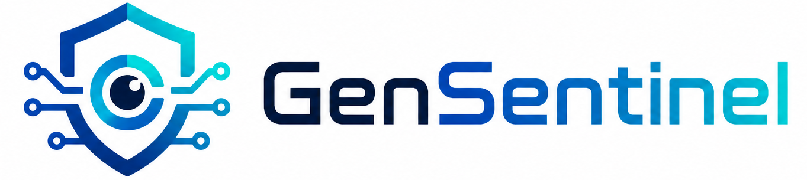

<div align="center">
  

  <br />
  <br />

  # GenSentinel

  **Générateur de clés et de secrets cryptographiques 100% côté client.**

  [](https://nextjs.org/)
  [](https://www.typescriptlang.org/)
  [](https://tailwindcss.com/)
  [](LICENSE)
</div>

<br />

> **GenSentinel** est une application web moderne qui permet aux développeurs de générer instantanément des mots de passe, des clés d'API, des UUIDs, des secrets JWT et plus encore, de façon sécurisée et sans aucun appel serveur (grâce à l'API Web Crypto native du navigateur).

---

## ✨ Fonctionnalités Principales

- 🛡️ **Sécurité Zéro-Trust** : 100% des clés sont générées via l'API locale `crypto.getRandomValues()`. Aucune clé n'est transmise sur le réseau.
- 🚀 **Performances instantanées** : Architecture statique propulsée par Next.js, rendue en quelques millisecondes.
- 🎨 **Multi-Thèmes Immersifs** : Alternez dynamiquement entre 4 environnements :
  - **Moderne Clair** & **Sombre** (Épuré et minimaliste)
  - **Terminal** (Brutalisme monospace avec un style ligne de commande rétro)
  - **Cyberpunk** (Haut contraste, glitch art, formes géométriques et néons)
- ⚙️ **Hautement Personnalisable** : Pour chaque générateur, ajustez la longueur, les symboles et la structure en temps réel.
- 🚫 **Zéro Tracking** : Pas d'analytique, pas de cookies, pas d'inscription. Un respect absolu de la vie privée.

## 🛠️ Générateurs Inclus

* 🔑 **Mots de passe** (Personnalisables, haute entropie)
* 🆔 **UUID v4** (Identifiants uniques universels)
* 🔐 **Secrets JWT** (Génération de sel HS256/RS256)
* 🔌 **Clés d'API** (Formats base64, hexadécimal, alphanumérique)
* 🔢 **Chaînes Hexadécimales** (WEP, WPA, etc.)
* 📶 **Mots de passe Wi-Fi** (Robustes et prêts à l'emploi)

---

## 🚀 Installation & Démarrage

GenSentinel est pensé pour tourner n'importe où, ou même localement sur votre machine de développement.

```bash
# 1. Cloner le dépôt
git clone https://github.com/neosoda/GenSentinel.git
cd GenSentinel

# 2. Installer les dépendances
npm install

# 3. Lancer le serveur de développement
npm run dev
```

Ouvrez ensuite [http://localhost:3000](http://localhost:3000) avec votre navigateur pour voir le résultat.

## 🏗️ Stack Technique

* **Framework** : [Next.js 15](https://nextjs.org/) (App Router, mode statique par défaut)
* **Langage** : [TypeScript](https://www.typescriptlang.org/) (Typage strict pour garantir l'intégrité des algorithmes de génération)
* **Design** : [Tailwind CSS v4](https://tailwindcss.com/) (Intégration via `@theme inline` et variables CSS)
* **Polices** : *Orbitron*, *JetBrains Mono*, *Geist*, implémentées via `next/font/google`.

## 🤝 Contribution

Les contributions sont les bienvenues ! Que ce soit pour ajouter un nouveau générateur, optimiser une animation ou proposer un nouveau thème :
1. Forkez le projet
2. Créez votre branche (`git checkout -b feature/nouveau-generateur`)
3. Commitez vos changements (`git commit -m 'Ajout du générateur Base64'`)
4. Poussez la branche (`git push origin feature/nouveau-generateur`)
5. Ouvrez une Pull Request

## 📄 Licence

Ce projet est sous licence MIT. Voir le fichier [LICENSE](LICENSE) pour plus d'informations.

<div align="center">
  <sub>Fait avec ❤️ pour la communauté des développeurs.</sub>
</div>
